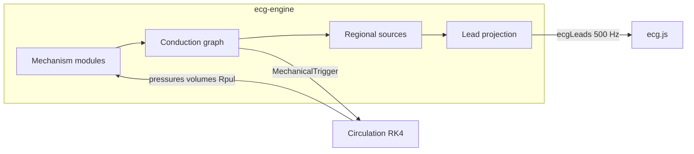

# Hybrid ECG Engine — Architecture (v0.1)

## Overview

The cardiovascular simulation uses a **deterministic hybrid ECG engine** coupled to a **closed-loop RK4 circulation model**. Diagnoses modify physiological mechanisms; the 12-lead ECG arises from regional activation, repolarization, and lead projection — never from diagnosis-specific waveform templates.

## Module map

```
source/src/domains/cardio/
  ecg-engine/           TypeScript — public API and all electrical simulation
    engine.ts           EcgEngine: initialize, step, drain, getOutput
    types/              PatientPhenotype, SharedPhysiology, MechanicalTrigger, …
    graph/              Conduction graph, event scheduler, AV/bundle pathways
    regions/            Dense tissue mesh (~300 patches: atrial + endo/mid/epi vent)
    graph/anisotropy.ts Helical fiber dirs + anisotropic travel times (fiber > sheet > transmural)
    sources/            Kernels + tissue synthesis (per-patch sources)
    projection/         Lead-field matrix (patch → electrodes → 12-lead)
    mechanisms/         Diagnosis-to-mechanism registry (29 pathologies)
    features/           PR, QRS, QT, axis measurement
    adapter/            Circulation bidirectional coupling
    validation/         Invariants and golden scenarios
  sim/
    worker.ts           Web Worker host (messages, timer, catalog)
    circulation.ts      RK4 hemodynamics (unchanged physics)
```

## Data flow



## Mid-scale tissue milestones

| Step | Status |
|------|--------|
| Dense patch mesh (~300) + lead-field projection | Done |
| Anisotropic activation (helical fiber, endo→epi slow) | Done |
| Morphology restore (axis/II, RV→V1, wavefront-coalesced QRS) | Done |
| Reduce residual ST/Brugada overlays once mesh ST is strong | Partial (gains cut) |
| Optional denser mesh (~500) if morphology still coarse | Later |

## Layer separation

1. **Ground truth** — active mechanisms, severities, shared physiology
2. **Observations** — electrode potentials, 12-lead signals, events
3. **Interpretation** — rule-based report from measured features only

## Coupling contract (§14)

| Direction | Interface |
|-----------|-----------|
| Electrical → mechanical | `MechanicalTrigger` per chamber (RA/LA/RV/LV) |
| Mechanical → electrical | Pressures, volumes, PVR, contractility → mechanism resolver |

## Runtime

- TypeScript compiled by esbuild into the Worker bundle
- Seeded deterministic PRNG (no `Math.random`)
- Internal synthesis 1000 Hz → output 500 Hz
- WASM deferred; hot paths isolated for future Rust migration

## Educational disclaimer

Generated ECGs are for learning only. Simulated disease may produce a normal or nondiagnostic ECG. Ground truth is hidden from learners when appropriate.
